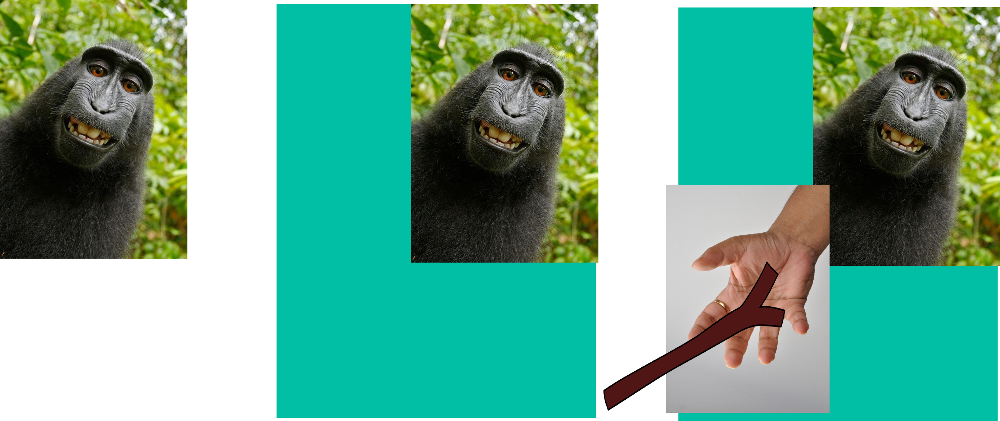

# project-ideas
## Idées d'apps, logiciels, fonctionnalités. Servez-vous.

### SelfieToSelfieStickPic

Transformer un selfie de l'utilisateur en ajoutant le selfie stick à la photo.

**Premières idées**

- "Étendre" la photo de l'utilisateur. Essayer de reprendre l'arriète plan, et le rallonger pour avoir une image plus grande.
- Rajouter une main, et un selfie stick:
  - Déterminer la direction (main, quelle côté de l'image)?
  - En bas à gauche ?
